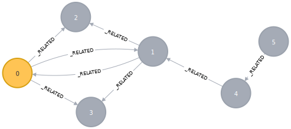

# k-hop!
> No, not _k-pop_...**k-hop**!

Given the following graph:



The _2-hop_ subgraph with origin `0` looks like (sorting edges for readability):

```json
[
  [0, 1], [0, 2], [0, 3],
  [1, 2], [1, 3], [1, 0],
  [4, 1]
]
```

Even simpler, for node `5`: `[[5, 4] [4, 1]]`

## neo4j_arrow & k-hop

For now, k-hop jobs piggyback on _GDS Read_ jobs until they get their own
messages, but the `neo4j_arrow.py` client exposes a dedicated method to make it
easy:

```python
import neo4j_arrow as na
client = na.Neo4jArrow('neo4j', 'password', (HOST, 9999))
ticket = client.khop('mygraph')
```
