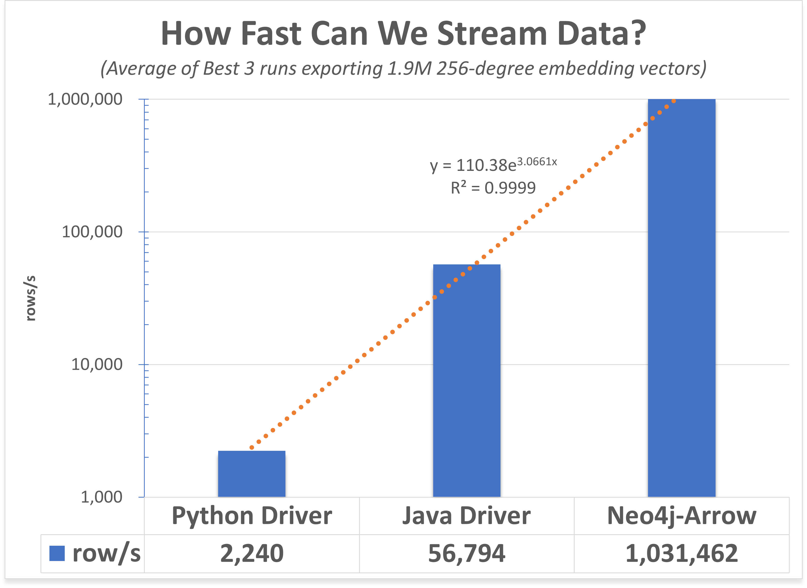

# Performance Testing
Date: 26 Aug 2021

## Test Environment

### Systems
* **Host**
  * Neo4j 4.3.3 Enterprise
  * GDS v1.6.4
  * GCP c2-standard-30 (30 vCPUs, 120 GB memory)
  * Ubuntu 21.04 (Linux 5.11.0-1017-gcp)
  * Zone northamerica-northeast1-a
* **Client**
  * Python 3.9.5
  * Neo4j Java Driver 4.3.3
  * Neo4j Python Driver 4.3.4
  * Ubuntu 21.04 (Linux 5.11.0-1017-gcp)
  * GCP e2-standard-8 (8 vCPUs, 32 GB memory)
  * Zone northamerica-northeast1-a
* **Data**
  * [PaySim](https://storage.googleapis.com/neo4j-paysim/paysim-07may2021.dump)
  * 1,892,751 Nodes
  * 5,576,578 Relationships

### The Graph Projection
The graph projection isn't complicated: it's just the entire graph :-)
```cypher
CALL gds.graph.create('mygraph', '*', '*');
```
From a cold start, this should take about `1,480 ms`.

### The Embeddings

```cypher
CALL gds.fastRP.mutate('mygraph', {
    concurrency: 28,
    embeddingDimension: 256,
    mutateProperty: 'n'
});
```

From a cold start, this should take about `4,670 ms`.

## Methodology

1. Warm-up with 5 runs per client type
2. Run 5 times after warm-up, recording throughput
3. Average the 3 best runs for the final result

### The Python Driver
The code is in [direct.py](../../direct.py). It runs the following Cypher:

```python
CALL gds.graph.streamNodeProperty('mygraph', 'n');
```

Time is measured using `time.time()` after submitting the transaction and 
just prior to iterating through results. Time is stopped after the last result.

### The Java Driver
The code is in the [strawman](../../strawman) subproject.

It also runs the same Cypher as the Python driver:

```python
CALL gds.graph.streamNodeProperty('mygraph', 'n');
```

Time is measured using `System.currentTimeMillis()` after submitting the 
transaction and just prior to iterating through results. Time is stopped 
after the last result.

### The Neo4j-Arrow Client
The code is in [client.py](../../client.py).

It submits the following `GdsMessage` and then requests the stream:

```json
{
  "db": "neo4j",
  "graph": "mygraph",
  "filters": [],
  "properties": ["n"]
}
```

Time is measured by `time.time()` after submitting the request for the 
stream and before iterating through the Arrow batches.

---

## Observations

Each test is measured in "rows/second" where each "row" is like:
 
```
[(long) nodeId, (float[256]) embedding]
```

Each row is approximately anywhere from `8 + 256*[4..8] ==> 1032..2056` 
bytes with some potential for additional metadata overhead. As a result, the 
approximate raw payload of 1.9M vectors is approximately 1.8 GiB or greater.

### Table 1: Performance Results

| Client         |   Best 1  |   Best 2  |   Best 3  |   Average | Std.Dev |
| -------------- | --------- | --------- | --------- | --------- | ------- |
| Python Driver  |     2,249 |     2,247 |     2,225 |     2,240 |      11 |
| Java Driver    |    57,356 |    57,356 |    55,669 |    56,794 |     795 |
| Neo4j-Arrow    | 1,055,474 | 1,030,174 | 1,008,737 | 1,031,461 |  19,102 |

| Client         | Discarded 1 | Discarded 2 |
| -------------- | ----------- | ----------- |
| Python Driver  |      2,177  |       2,137 |
| Java Driver    |      55,669 |      55,669 |
| Neo4j-Arrow    |     879,622 |   1,004,904 |

## Figure 1: Visualizing the Results



# Conclusions
This test focused on a specific use-case: _streaming homogenous feature 
vectors._ In this use case, Neo4j-Arrow is **orders of magnitude faster than 
traditional approaches with Python and over 1 order of magnitude faster than 
using the Java Driver.**

## Discussion
There are some fundamental differences between Neo4j-Arrow and the existing 
drivers:

1. **Parallelism**: Arrow Vectors can be assembled in parallel from the GDS 
   in-memory graph. It's not clear if the GDS procs can be changed to 
   benefit from concurrency as it would require changes to the Cypher 
   runtime and/or to Bolt.

2. **Efficiency**: Arrow can leverage schema with homogenous data to more 
   efficiently pack data on the wire, especially sparse data. (In this test, 
   the data isn't sparse.) On the client-side, client's don't need to 
   "deserialize" the data off the wire and only interpret the data on-demand,
   as-needed...and with the help of a schema.